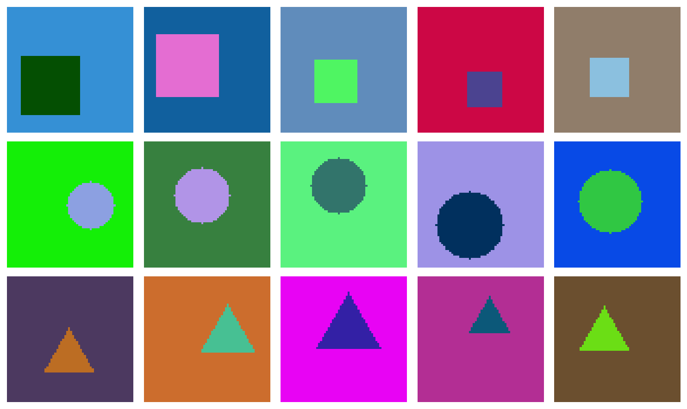
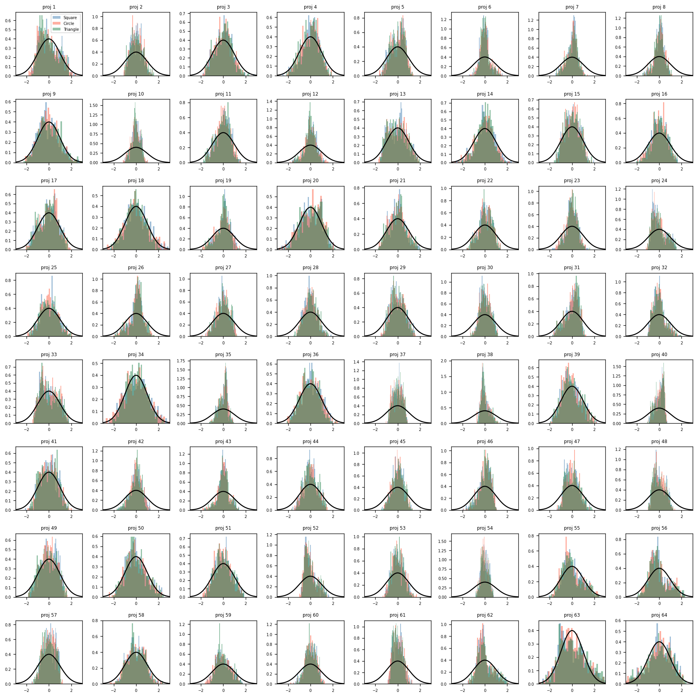

# Learning LeWorldModel

Exploring **Joint Embedding Predictive Architecture (JEPA)** style representation learning,
starting from a synthetic shapes experiment and building toward a full world model for `LunarLander-v3`.

## lejepa — Representation Learning on Synthetic Shapes

Before applying JEPA-style representation learning to a real environment, we first validate the
approach on a simple synthetic dataset of 64×64 pixel images containing three shape types:
**squares**, **circles**, and **equilateral triangles**. Each image has a randomly chosen
foreground and background color (guaranteed to be visually distinct), a random position near
the image center, and a randomly varying size — all fully within the image bounds.

### Goal

Train a convolutional encoder to produce a **64-dimensional latent vector** for each image such that:
- Same-class images map to nearby embeddings (pulled together via MSE to the batch mean)
- The latent space does not collapse (prevented by SIGReg)

### Example images

Each row shows 5 random samples of one shape type:



### Training setup

- **Encoder:** 3 conv layers (3→6→12→24 channels, stride-2) + MLP head (24×8×8 → 128 → 64)
- **Loss:** `MSE(Z, mean(Z)) + λ · SIGReg(Z)` where `λ = 0.1`
- **Batch:** 64 same-class images per step; target is the mean embedding of the batch
- **Optimizer:** Adam with cosine annealing LR schedule

### Latent space projections

After training, we project 500 embeddings per class onto 64 random unit-norm directions and
compare each distribution to a standard Gaussian N(0,1) (black curve). A well-trained encoder
should show roughly Gaussian projections, and class-specific clusters indicate the encoder has
learned shape-discriminative features:



### Open question

**Why does `L_pred` not drop during training?** The MSE-to-mean loss encourages all embeddings
within a batch to collapse toward their mean, but SIGReg pushes back to maintain spread. It is
unclear whether the balance between these two forces is well-calibrated, or whether a different
formulation of the contrastive signal is needed.

---

## Setup

```bash
uv sync
```

---

## LeWorldModel — LunarLander Adaptation

An implementation of **LeWorldModel (LeWM)** adapted to the `LunarLander-v3` environment.

LeWM learns a latent world model directly from raw pixel observations — no reconstruction losses,
no reward signals, no pre-trained encoders. It was introduced in:

> *LeWorldModel: Stable End-to-End Joint-Embedding Predictive Architecture from Pixels*
> Maes, Le Lidec, Scieur, LeCun, Balestriero — arXiv:2603.19312

The model learns two things from offline pixel trajectories:

- **Encoder** — maps raw frames into a compact latent representation
- **Predictor** — models environment dynamics by predicting the next latent state given the current
  one and an action

Training uses only two loss terms: an MSE prediction loss and a SIGReg regularizer that prevents
representation collapse by encouraging latent embeddings to follow an isotropic Gaussian distribution.

At inference time, the model plans action sequences in latent space using the Cross-Entropy Method
(CEM) inside a Model Predictive Control (MPC) loop.

### Project stages

1. Encoder
2. Predictor
3. SIGReg + training loop
4. Latent planning (CEM + MPC)
5. Closed-loop action execution
6. Comparison with baseline algorithms (A2C, PPO)

### Run baseline

```bash
uv run baseline_algorithms/run_baseline_example.py
```
